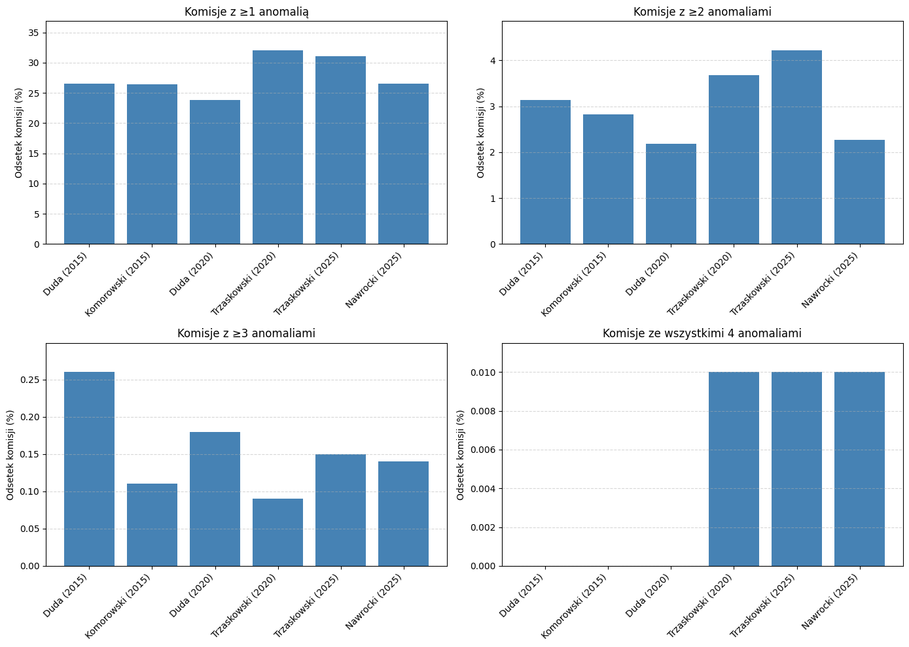

# Analiza metodologii zastosowanej przez dr. Krzysztofa Kontka

Niniejsza "analiza analizy" powstała jako odpowiedź na [artykuł dr. Krzysztofa Kontka](https://papers.ssrn.com/sol3/papers.cfm?abstract_id=5296441), który stał się przedmiotem [szerokiego zainteresowania mediów](https://wyborcza.pl/7,75398,32037270,dr-krzysztof-kontek-przeanalizowal-wyniki-wyborow-w-calej-polsce.html#s=S.MT-K.C-B.1-L.1.duzy).

## Cel

Celem tej pracy było sprawdzenie, czy metody użyte przez autora są rzeczywiście trafne i adekwatne do analizy danych wyborczych. 

Pierwszym krokiem było zastosowanie ich w obie strony (to znaczy do wyników obu kandydatów), czego autor nie uczynił. Dzięki temu pokazujemy, że "anomalie" występowały w obu przypadkach, dlatego ciężko mówić o sfałszowaniu wyników na korzyść jednego z kandydatów.

Drugim krokiem natomiast było zastosowanie do wyników wyborów prezydenckich z poprzednich lat. To pozwoliło uzyskać "podejrzane" komisje wyborcze w wyborach, które nie budziły podobnych kontrowersji.

W związku z tym nasuwają się dwa wnioski:  
- albo mamy do czynienia z ogólnopolskim spiskiem trwającym od wielu lat,  
- albo – co znacznie bardziej prawdopodobne – zastosowane metody są błędne

## Podziękowania

Szczególne podziękowania kieruję do Pana Jakuba Białka – jego wcześniejsza implementacja znacząco przyspieszyła przygotowanie tej analizy

## Brak transparentności

Niestety, dokładne odwzorowanie metod dr. Kontka nie było możliwe:

- Opis algorytmów w artykule jest niedokładny
- Kod źródłowy nie został udostępniony publicznie
- Próby kontaktu z autorem (m.in. przez e-mail i media społecznościowe, takie jak LinkedIn) pozostały bez odpowiedzi, natomiast widać że autor jest w internecie aktywny

Gdyby kod został opublikowany, mógłbym go tutaj natychmiast uwzględnić i przeprowadzić analizę 1:1. 
Tego jednak zabrakło, co budzi uzasadnione wątpliwości co do intencji autora: czy rzeczywiście zależało mu na obiektywnej analizie i prawdzie, czy może raczej na wywołaniu emocji i medialnego rozgłosu?

Gdybym sam chciał zweryfikować nieprawidłowości wyborcze:
- udostępniłbym kod źródłowy,
- dokładnie opisał metody krok po kroku,
- i aktywnie odpowiadał na pytania i zastrzeżenia – wspólnie szukając lepszego modelu i pełniejszego zrozumienia danych.

## Przykład niejasności: grupowanie po kodach pocztowych

Jednym z kluczowych etapów analizy było grupowanie komisji wyborczych na podstawie kodów pocztowych. Autor artykułu ogólnie opisał ideę takiego podejścia, jednak opis ten jest zbyt mało szczegółowy, żeby można go było odtworzyć.

W niniejszym repozytorium znajdują się moje trzy moje próby podziału oraz implementacja Pana Białka, która ostatecznie została wykorzystana. W efekcie uzyskaliśmy 2367 grup zamiast deklarowanych przez autora 2208. 

Choć różnica ta prawdopodobnie nie wpływa znacząco na ogólny obraz wyników, to pokazuje, że analiza ta nie jest identyczna z oryginałem – głównie z powodu braku precyzji w opisie metodyki.

## Odpowiedź na potencjalny zarzut
Zapewne autor może w takim razie stwierdzić - "to nie są moje obliczenia, więc cała ta analiza jest bez sensu". I zapewne będzie mieć w tym trochę racji, jednak doprowadziło do tego brak dostępu do kodu i nieprecyzyjny opis metod uniemożliwiają wierne odtworzenie wyników. Pomimo tego, uważam, że nawet przybliżone odwzorowanie pozwala wskazać poważne słabości i błędy w metodologii oryginalnej analizy.

## Komentarz wyników
Jak widać, wyniki z roku 2025 nie odbiegają istotnie od danych z lat wcześniejszych. Rozkład liczby anomalii — niezależnie od kandydata — pozostaje na porównywalnym poziomie w każdej analizowanej elekcji.

Oczywiście nie oznacza to, że błędy nie występują. Przy ponad 32 tysiącach komisji wyborczych, ludzki błąd oraz statystyczne odchylenia są nieuniknione. To naturalny element każdego dużego procesu organizacyjnego.

Nie powinniśmy jednak na podstawie jednostkowych przypadków tracić zaufania do instytucji państwowych ani podważać fundamentów demokracji. Wyciąganie ogólnych wniosków na podstawie kilku obserwacji może prowadzić do niepotrzebnej polaryzacji i chaosu informacyjnego.

To, co możemy i powinniśmy robić, to stale udoskonalać systemy liczenia i rejestrowania głosów — zarówno po stronie technicznej (informatycznej), jak i organizacyjnej, by minimalizować ryzyko pomyłek i zwiększać przejrzystość procesu.

## Uwagi metodologiczne

W notatniku `kontek.ipynb` zaimplementowano metody wraz z komentarzami i wątpliwościami.

dlaczego metodologia wzbudza tyle wątpliwości?

* ### Clustrowanie (grupowanie komisji) po kodach pocztowych
Choć intuicyjne, może być w niektórych przypadkach nietrafione — kody pocztowe nie zawsze dobrze odwzorowują rzeczywiste granice geograficzne czy społeczne. Dodatkowo, nie usunięto komisji o bardzo specyficznym charakterze (szpitale, domy pomocy społecznej, areszty śledcze, zakłady karne czy komisje zagraniczne) - których wyniki mogą odbiegać od "typowej" komisji

* ### Losowe grupowanie komisji
W ramach testu przeprowadzono również eksperyment polegający na losowym podziale komisji na grupy o rozmiarach zbliżonych do tych, które Kontek uzyskał przez grupowanie po kodach pocztowych (tj. 10–16 komisji w grupie, notatnik `kontek_2025_grupowanie_losowe`).

Celem było sprawdzenie, czy metoda oparta na Median Absolute Deviation (MAD) wykazuje większą skuteczność przy rzeczywistych, przestrzennie sensownych grupach — czy też anomalia pojawia się nawet w czysto losowym układzie.

**Wyniki**: liczba wykrytych „anomalii” w grupowaniu losowym była podobna (lub nawet większa!) jak w grupowaniu opartym na kodach pocztowych. Również wskaźnik "flip", który miał wskazywać lokalne odwrócenie wyniku, występował równie często.

To prowadzi do istotnego wniosku:
jeśli metoda generuje tyle samo anomalii przy losowym podziale danych, co przy grupowaniu lokalnym — to nie identyfikuje realnych odstępstw, tylko naturalne fluktuacje.
W takim przypadku jej wartość analityczna jest wątpliwa, a ryzyko nadinterpretacji – bardzo wysokie.

* ### Metoda "flip"
Zastosowana przez autora metoda "flipowania" wydaje się w tym kontekście bezzasadna - [wyjaśnione przez Pana Piotra Szulca](https://danetyka.com/kontek-analiza-bledow/) i opisane przeze mnie w notatniku.

* ### Jednostronność analizy
Autor skupił się wyłącznie na jednej stronie politycznego sporu, co tłumaczył „brakiem czasu”. Jak jednak pokazano w niniejszym repozytorium, rozszerzenie analizy na inne lata lub przeciwną stronę nie wymagało znaczącego nakładu pracy. Trudno więc oprzeć się wrażeniu, że taki wybór był przynajmniej częściowo intencjonalny — co podważa obiektywność całej analizy.

Na zarzut o jednostronność autor odpowiedział w jednym z [publicznych wywiadów](https://www.youtube.com/watch?v=m1XmlVc4E-o), że analizując drugą stronę polityczną, odkryłby jeszcze więcej „podejrzanych” komisji, więc mamy do czynienia z jeszcze większym "fałszerstwem". Wydaje się jednak, że jeżeli ten sam model wykazuje odchylenia w **obie strony**, to nie jest to dowód na wszechobecne fałszerstwa, lecz znak, że **model sam w sobie błędnie identyfikuje anomalię**. Model, który nie rozróżnia szumu od sygnału, nie powinien być podstawą do wysuwania tak poważnych oskarżeń.

Dodatkowo w artykule możemy przeczytać:

> „W niektórych przypadkach zastosowanie tej procedury skutkowałoby zwiększeniem liczby głosów dla Nawrockiego. W takich sytuacjach jego pierwotny wynik pozostawiono bez zmian — nie wprowadzano korekty „w górę”, co odzwierciedla konserwatywne podejście, mające na celu uniknięcie sztucznego zawyżania jego poparcia.”

Tego rodzaju podejście — w którym korekty są stosowane tylko w jedną stronę — stoi w jawnej sprzeczności z zasadami rzetelnej analizy danych. Jeśli model wskazuje, że zarówno zawyżenia, jak i zaniżenia są możliwe, to korekty (o ile w ogóle je wprowadzać) powinny być symetryczne. Inaczej otrzymujemy **celową manipulację wynikami pod z góry założoną tezę**.

Na koniec, autor podkreśla, że komisje wskazane przez jego model zostały wybrane do ponownego liczenia głosów — co ma dowodzić skuteczności podejścia. Warto jednak przypomnieć, że według jego własnych założeń model wskazuje **ponad 5500 „anomalii” na 32 000 komisji**. Przy tak szerokim zasięgu „podejrzeń” trafienie kilku realnie sprawdzonych przypadków było statystycznie całkiem prawdopodobne – i w żaden sposób nie dowodzi poprawności modelu.

* ### Zbyt duża liczba anomalii
> "Przy nieco mniej rygorystycznym progu k > 2.0, liczba anormalnych komisji wzrosła do 5 453, co odpowiada 17,2% wszystkich komisji krajowych."

Jeżeli w procesie wykrywania anomalii okazuje się, że aż 17% danych zostało oznaczonych jako anomalie, to istnieje duże ryzyko, że sam model lub algorytm był trenowany na danych już zanieczyszczonych. W takiej sytuacji założenie, że dane normalne dominują, może być złamane, co prowadzi do zniekształcenia wyników. Warto wtedy zastosować iteracyjne podejście do wykrywania anomalii lub metody odporne na outliery, aby ograniczyć wpływ nieprawidłowych obserwacji na cały proces detekcji.

* ### Wykrywanie outlierów

Za potencjalne obserwacje odstające uznano komisje, w których wystąpiła choćby jedna anomalia. Wydaje się jednak, że za rzeczywiście podejrzane należałoby uznać przypadki, w których wystąpiły np. minimum trzy na cztery "wykroczenia". Wyjątkiem może być sytuacja, w której kandydat uzyskuje mniejszą liczbę głosów w drugiej turze niż w pierwszej — co samo w sobie budzi poważne wątpliwości. Tego rodzaju przypadki powinny być identyfikowane już na etapie wprowadzania danych do systemu

## Potencjalne zastosowania modelu w praktyce

Mimo opisanych zastrzeżeń, metody zaproponowane w artykule mogą — po odpowiednich modyfikacjach — znaleźć sensowne i praktyczne zastosowanie, szczególnie jako narzędzia wspierające organizację procesu wyborczego. Przykładowe scenariusze użycia:

- **automatyczne ostrzeganie** podczas wprowadzania wyników do systemu, jeśli dane z danej komisji znacząco odbiegają od wzorca ustalonego dla danej grupy lokalnej;

- **analiza post factum** — pomocna przy wskazywaniu komisji, które warto objąć dodatkową weryfikacją lub audytem (np. ponownym przeliczeniem głosów).

Tego typu podejścia mogą realnie zwiększyć wiarygodność procesu wyborczego, jednocześnie zachowując szacunek dla jego demokratycznych fundamentów — pod warunkiem, że są stosowane przejrzyście, obiektywnie i bez nadinterpretacji.

## Porównanie wyników

Dla porównania — w plikach `kontek_2020.ipynb` oraz `kontek_2015.ipynb` zaimplementowano te same algorytmy, ale na danych z lat odpowiednio 2020 i 2015. W obu przypadkach uzyskano wyniki porównywalne z rokiem 2025, co również przemawia za koniecznością ostrożnej interpretacji wskaźników „anomalii”.

Uważam, że podane w artykule metody są niepoprawne. Niemniej jednak, stosując je do innych lat, możemy mieć jakieś porównanie.

[Liczba komisji wyborczych się zmienia](https://demagog.org.pl/wypowiedzi/protesty-wyborcze-czy-wzrost-liczby-komisji-ma-znaczenie/) (np. w 2025 było ponad 30 tys., a w 2020 – 26 tys.), dlatego wyniki zostały znormalizowane. Większa liczba komisji to większa skala operacji i naturalnie większa liczba miejsc, w których może dojść do błędu — bez względu na intencje.

### 📊 Odsetek komisji z wykrytymi anomaliami (wg liczby anomalii)

Poniższa tabela przedstawia odsetek komisji obwodowych, w których wykryto co najmniej 1, 2, 3 lub wszystkie 4 typy anomalii dla poszczególnych kandydatów w latach 2015, 2020 i 2025.

| Rok  | Kandydat     | ≥1 (%) | ≥2 (%) | ≥3 (%) |   =4 (%) |
|------|--------------|--------|--------|--------|----------|
| 2015 | Duda         | 26.58  | 3.14   | 0.26   | 0.0037   |
| 2015 | Komorowski   | 26.39  | 2.82   | 0.11   | 0.0000   |
| 2020 | Duda         | 23.81  | 2.18   | 0.18   | 0.0000   |
| 2020 | Trzaskowski  | 32.07  | 3.67   | 0.09   | 0.0076   |
| 2025 | Trzaskowski  | 31.05  | 4.22   | 0.15   | 0.0098   |
| 2025 | Nawrocki     | 26.54  | 2.27   | 0.14   | 0.0065   |

> **Legenda**:
> - `≥1 (%)` — odsetek komisji z co najmniej jedną anomalią
> - `≥2 (%)` — z co najmniej dwiema
> - `≥3 (%)` — z co najmniej trzema
> - `=4 (%)` — ze wszystkimi czterema anomaliami jednocześnie

Dane te pozwalają porównać rozkład anomalii niezależnie od roku i liczby komisji.

### per anomalia

Poniżej przedstawiono odsetek komisji obwodowych, w których wystąpiła dana pojedyncza anomalia. Każda tabela dotyczy jednego typu anomalii. Dane zostały znormalizowane względem liczby komisji w danym roku.

#### pop_outlier

| Rok  | Kandydat     | Odsetek (%) |
|------|--------------|-------------|
| 2025 | Trzaskowski  | 14.90       |
| 2020 | Trzaskowski  | 13.09       |
| 2025 | Nawrocki     | 12.28       |
| 2015 | Komorowski   | 11.95       |
| 2020 | Duda         | 11.03       |
| 2015 | Duda         | 10.93       |

#### growth_outlier

| Rok  | Kandydat     | Odsetek (%) |
|------|--------------|-------------|
| 2020 | Trzaskowski  | 14.48       |
| 2025 | Trzaskowski  | 11.63       |
| 2015 | Duda         | 11.47       |
| 2025 | Nawrocki     | 10.24       |
| 2015 | Komorowski   | 10.27       |
| 2020 | Duda         | 7.10        |

#### flip

| Rok  | Kandydat     | Odsetek (%) |
|------|--------------|-------------|
| 2025 | Trzaskowski  | 8.54        |
| 2020 | Duda         | 7.63        |
| 2020 | Trzaskowski  | 7.19        |
| 2015 | Komorowski   | 6.73        |
| 2015 | Duda         | 6.53        |
| 2025 | Nawrocki     | 6.03        |

#### more_votes

| Rok  | Kandydat     | Odsetek (%) |
|------|--------------|-------------|
| 2020 | Trzaskowski  | 1.08        |
| 2015 | Duda         | 1.07        |
| 2025 | Nawrocki     | 0.42        |
| 2020 | Duda         | 0.40        |
| 2025 | Trzaskowski  | 0.37        |
| 2015 | Komorowski   | 0.35        |

**Uwaga**: _Wartości mogą się nakładać — tzn. jedna komisja może jednocześnie zawierać wiele różnych anomalii. Dlatego te tabele należy traktować jako niezależne przekroje, a nie sumujące się całości._

#### losowe grupowanie komisji (a nie wg kodu pocztowego)

Dodatkowo, przeprowadzono test z losowym podziałem komisji na grupy, niezależnie od ich położenia geograficznego czy kodu pocztowego. Celem było sprawdzenie, czy metodologia oparta na grupowaniu przestrzennym rzeczywiście wnosi istotną wartość – to znaczy: czy anomalia wykryta w kontekście lokalnym różni się jakościowo od przypadkowego rozrzutu.

Wyniki tej próby okazały się zaskakujące: mimo całkowicie losowego grupowania, wskaźniki anomalii utrzymały się na poziomie zbliżonym, a w niektórych przypadkach (np. dla Trzaskowskiego) były nawet wyższe niż w oryginalnej analizie dr Kontka.

Na przykład:

liczba anomalii typu pop_outlier dla Trzaskowskiego w losowym wariancie wyniosła 6234 komisje, wobec 4551 w wersji „przestrzennej”,

wskaźnik flip, który miał rzekomo identyfikować lokalne odwrócenia preferencji wyborczych, wystąpił w 9290 komisjach w wariancie losowym – więcej niż w jakimkolwiek innym przypadku.

To silnie sugeruje, że metoda nie wychwytuje prawdziwych anomalii przestrzennych, lecz reaguje na naturalne statystyczne odchylenia w danych procentowych – niezależnie od struktury grup. Innymi słowy: model nie odróżnia anomalii od szumu.

W związku z tym wszystkie wnioski oparte na liczbie „anomalii” powinny być interpretowane z najwyższą ostrożnością, a sam model wymaga poważnej rewizji — zarówno pod względem definicji cech (zwłaszcza „flip”), jak i procedury grupowania.

## Źródła

* [Raport Fundacji Batorego](https://www.batory.org.pl/publikacja/falszerstwa-czy-falszywe-alarmy-statystyczna-kontrola-wynikow-ii-tury-wyborow-prezydenckich-2025/)

* [danetyka.com](https://danetyka.com/kontek-analiza-bledow/)

* [analiza Jakuba Białka](https://github.com/rabitwhte/analiza_kontka_reprodukcja/blob/main/Reprodukcja_wynikow_Kontek_Bialek.ipynb)